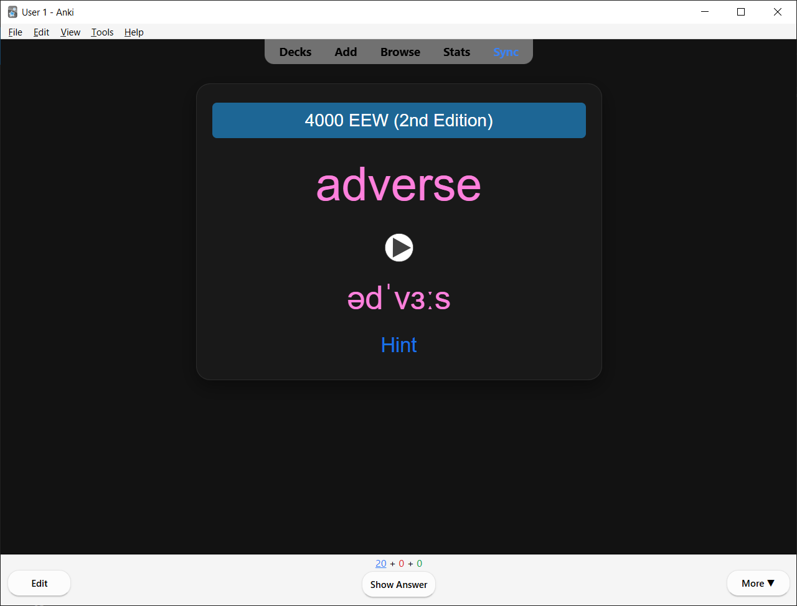
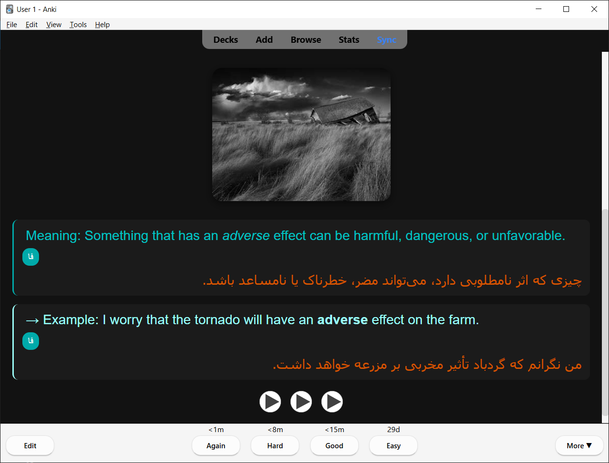
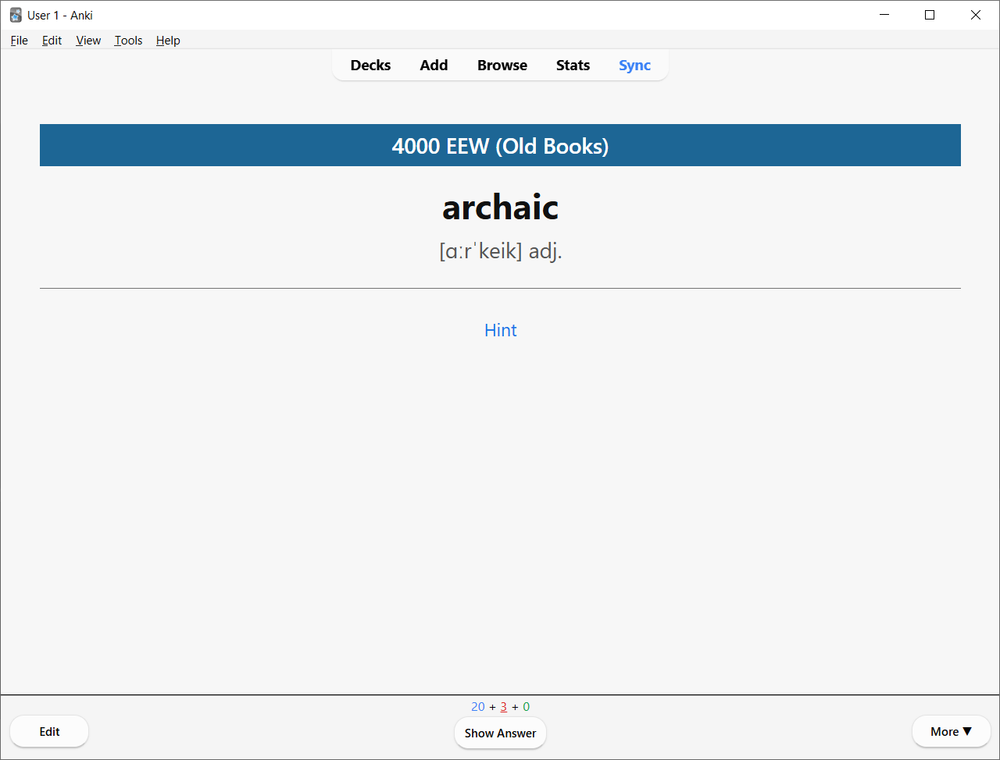
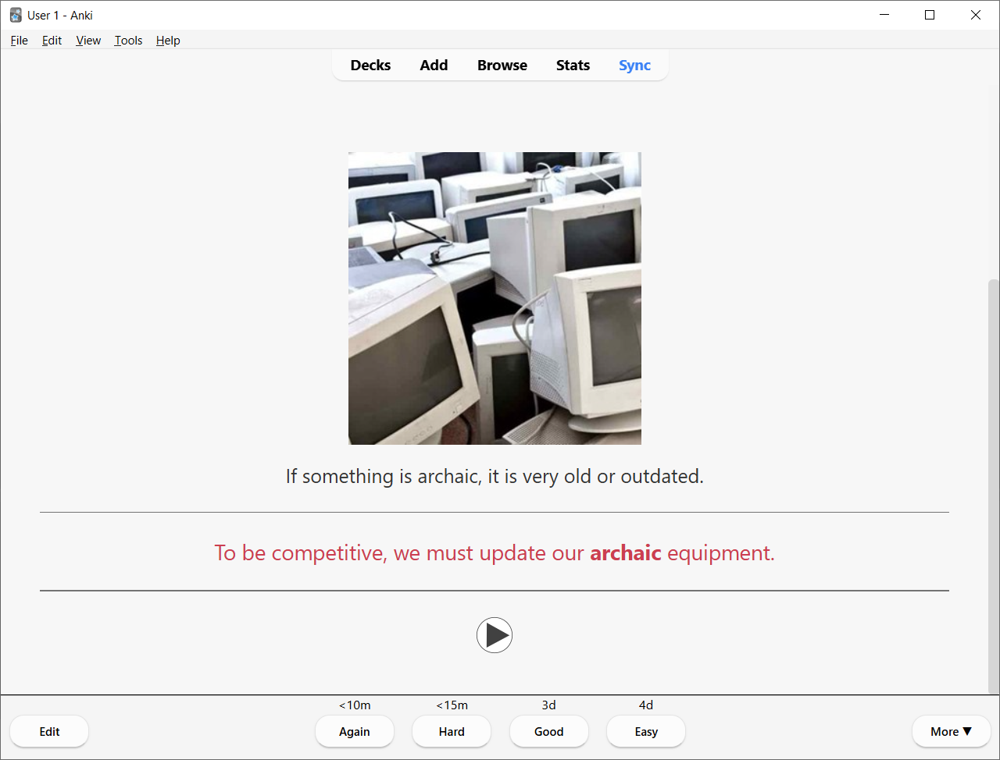

# 4000 Essential English Words – Data Extractor

A robust Python-based downloader for extracting vocabulary data, images, and audio files from the **4000 Essential English Words** learning platform.

This tool automatically downloads structured vocabulary data (`data.json`) along with all associated **media assets (images and pronunciation audio)** for every unit and book.

---

## Data Source

All data is extracted from:
https://www.essentialenglish.review

This repository provides tools to download the publicly available resources, and also tracks the downloaded data and generated Anki decks under `data/` and `dist/`. All intellectual property rights belong to the original publisher.

## Supported Edition

Currently supported:
✅ **4000 Essential English Words – First Edition (Old Books)**
✅ **4000 Essential English Words – Second Edition**

## Ready-to-Use Decks

Pre-built `.apkg` decks are published on the [Releases](../../releases) page — no need to run the scripts yourself.

### 4000 EEW (2nd Edition)

Built on top of the shared **"4000 Essential English Words"** AnkiWeb deck ([ankiweb.net/shared/info/1104981491](https://ankiweb.net/shared/info/1104981491), based on the book by Paul Nation, Compass Publishing), with two additions:
- **Hint** — a contextual example sentence for each word, extracted from the official 2nd Edition reading passages
- **FaMeaning / FaExample** — Persian (Farsi) translations of the Meaning and Example fields, shown as a collapsible "فا" toggle

📥 Download: [Release v2.0.0](../../releases/tag/v2.0.0)

| Front | Back |
|---|---|
|  |  |

### 4000 EEW (Old Books / First Edition)

The original 6-book deck generated from `data/old-books/`, with contextual Hint sentences extracted from the reading passages.

📥 Download: [Release v1.0.0](../../releases/tag/v1.0.0)

| Front | Back |
|---|---|
|  |  |

## Features

- **Automated Extraction:** Downloads vocabulary metadata, images, and audio.
- **Robustness:** Built-in retry mechanisms for network failures.
- **Efficiency:** Streaming downloads to optimize memory usage and "skip existing" logic to prevent redundant downloads.
- **Organization:** Automatic creation of a structured `data/` directory for each book.
- **Proxy Support:** Configurable proxy settings for restricted network environments.
- **Anki Deck Generation:** Builds `.apkg` decks from the scraped data, with story-based Hint sentences and Persian (Farsi) translations.

## Project Structure

All scripts assume they are run from the repo root (e.g. `python scripts/scrape/download_old_books.py`).

```text
scripts/
  scrape/               # Downloaders for each edition
    download_2nd_edition.py
    download_old_books.py
  generate/             # Builds .apkg decks from scraped data
    anki_generator.py
  translate/             # Adds Hints / Persian translations to an existing deck
    add_hints_to_shared_deck.py
    translate_deck_dahl.py
    translate_deck_deepl.py

data/                   # Raw scraped data (data.json, images/, audio/) per book
  2nd-edition/book{1..6}/
  old-books/book{1..6}/

dist/                   # Generated Anki decks (.apkg)
  old-books/
  shared-deck/

docs/                   # Screenshots referenced in this README
```
